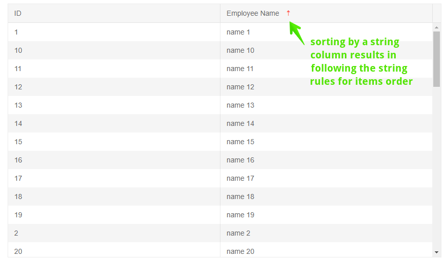

# Grid Sorting

The Grid component offers support for sorting.

To enable sorting, set the grid's `Sortable` property to `true`.

When the user clicks the column header, the grid will sort the data according to the column's data type, and an arrow indicator of the sorting direction will be shown next to the column title.

>caption Enable Sorting in Telerik Grid

````CSHTML
@using Telerik.Blazor

<TelerikGrid Data="@MyData" Sortable="true">
	<TelerikGridColumns>
		<TelerikGridColumn Field="ID"></TelerikGridColumn>
		<TelerikGridColumn Field="TheName" Title="Employee Name"></TelerikGridColumn>
	</TelerikGridColumns>
</TelerikGrid>

@functions {
	public IEnumerable<object> MyData = Enumerable.Range(1, 50).Select(x => new { ID = x, TheName = "name " + x });
}
````

>caption The result from the code snippet above, after the user clicked on the "Employee Name" header to sort



You can sort this grid on the different columns to see the results. The name column is a string, and sorting is done according to the rules for strings, while the ID column sorts acording to rules for integers.

## See Also

  * [Live Demo: Grid Sorting](https://demos.telerik.com/blazor/grid/sorting)
   
  