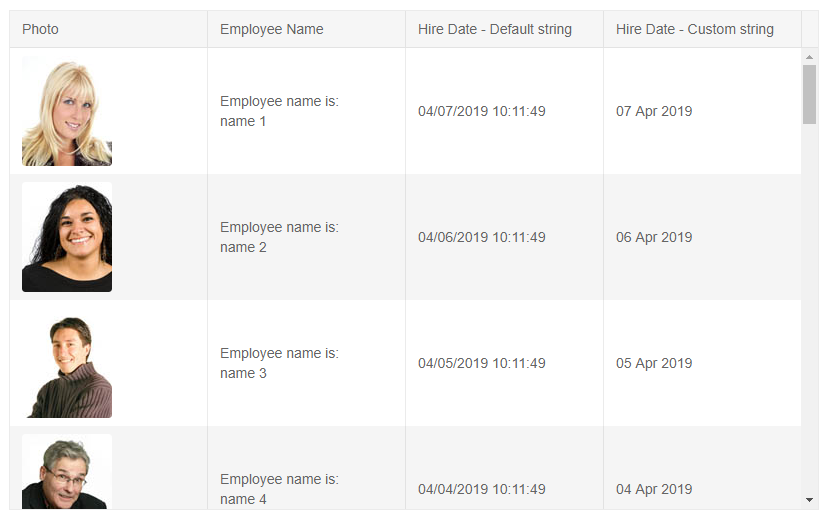
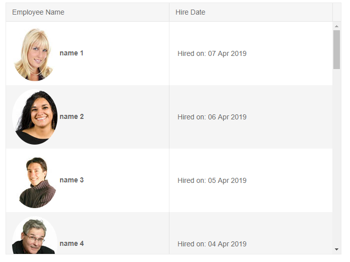

# Grid Templates

The Grid component can use templates for [rows](#row-template), [columns (cells)](#column-template) and [editing of a field](#edit-template).

Like other Blazor content, they can receive a `context` argument that is the type of the model. To use templates, you must bind the grid to a named model.

You must make sure to provide valid HTML in the templates.

You can also use templates to [bind to navigation properties in complex objects]().

## Column Template

By default, the grid renders the value of the field in the column, as it is provided from the data source. You can change this behavior by using the `Template` of the column and add your own content and/or logic to make a string out of the object.

The example below shows how to:

* set the `Template` (make sure to use the capital `T`, at the time of writing the Visual Studio autocomplete tends to use the lowercase `t` which breaks the template logic and does not allow you to access the context)
* access the `context` of the model item so you can employ your own logic
* set HTML in the column
* use inline or multi-line template
* take the field name from the model

>caption Using cell (column) template

````CSHTML
@using Telerik.Blazor.Components.Grid

<TelerikGrid Data="@MyData">
	<TelerikGridColumns>
		<TelerikGridColumn Field="@(nameof(SampleData.ID))" Title="Photo">
			<Template>
				@{
					var employee = context as SampleData;
					
				}
			</Template>
		</TelerikGridColumn>
		<TelerikGridColumn Field="@(nameof(SampleData.Name))" Title="Employee Name">
			<Template>
				Employee name is:
				<br />
				@((context as SampleData).Name)
			</Template>
		</TelerikGridColumn>
		<TelerikGridColumn Field="HireDate" Title="Hire Date - Default string">
		</TelerikGridColumn>
		<TelerikGridColumn Field="HireDate" Title="Hire Date - Custom string">
			<Template>
				@((context as SampleData).HireDate.ToString("dd MMM yyyy"))
			</Template>
		</TelerikGridColumn>
	</TelerikGridColumns>
</TelerikGrid>

@functions {
	public class SampleData
	{
		public int ID { get; set; }
		public string Name { get; set; }
		public DateTime HireDate { get; set; }
	}

	public IEnumerable<SampleData> MyData = Enumerable.Range(1, 50).Select(x => new SampleData
	{
		ID = x,
		Name = "name " + x,
		HireDate = DateTime.Now.AddDays(-x)
	});
}
````

>caption The result from the code snippet above



## Row Template

The row template allows you to define in your own code the entire contents of the `<tr>` element the grid will render for each record. To set it, provide contents to the `<RowTemplate>` inner tag of the grid.

It can be convenient if you want to use templates for most or all of the columns, as it requires less markup than setting individual templates for many columns.

The contents of the row template must be `<td>` elements and their number (or total `colspan`) must match the number of columns defined in the grid.

You can use the `Context` attribute of the `<RowTemplate>` tag of the grid to set the name of the context variable. Its type is the model type to which the grid is bound.

>caption Using a row template

````CSHTML
@using Telerik.Blazor.Components.Grid

<TelerikGrid Data=@MyData>
	<RowTemplate Context="employee">
		<td>
			
			<strong>@employee.Name</strong>
		</td>
		<td>
			Hired on: @(String.Format("{0:dd MMM yyyy}", employee.HireDate))
		</td>
	</RowTemplate>
	<TelerikGridColumns>
		<TelerikGridColumn Field=@nameof(SampleData.Name) Title="Employee Name" />
		<TelerikGridColumn Field=@nameof(SampleData.HireDate) Title="Hire Date" />
	</TelerikGridColumns>
</TelerikGrid>

@functions {
	public class SampleData
	{
		public int ID { get; set; }
		public string Name { get; set; }
		public DateTime HireDate { get; set; }
	}

	public IEnumerable<SampleData> MyData = Enumerable.Range(1, 50).Select(x => new SampleData
	{
		ID = x,
		Name = "name " + x,
		HireDate = DateTime.Now.AddDays(-x)
	});
}
````

>caption The result from the code snippet above



## Edit Template

The column's `EditTemplate` defines the inline template or component that will be rendered when the user is [editing](#editing) the field.

>caption Sample edit template

````CSHTML
@using Telerik.Blazor.Components.Grid

<TelerikGrid Data=@MyData EditMode="inline" Pageable="true">
	<TelerikGridColumns>
		<TelerikGridColumn Field=@nameof(SampleData.ID) Title="ID" />
		<TelerikGridColumn Field=@nameof(SampleData.Name) Title="Name" />
		<TelerikGridColumn Field=@nameof(SampleData.Role) Title="Position">
			<EditorTemplate>
				@{
					CurrentlyEditedEmployee = context as SampleData;
					<select onchange=@SaveRoleToModel value=@CurrentlyEditedEmployee.Role>
						@foreach (string item in Roles)
						{
							<option value=@item>@item</option>
						}
					</select>
				}
			</EditorTemplate>
		</TelerikGridColumn>
		<TelerikGridCommandColumn>
			<TelerikGridCommandButton Command="Update" Icon="save" ShowInEdit="true">Update</TelerikGridCommandButton>
			<TelerikGridCommandButton Command="Edit" Icon="edit">Edit</TelerikGridCommandButton>
		</TelerikGridCommandColumn>
	</TelerikGridColumns>
	<TelerikGridEvents>
        <EventsManager OnUpdate="@UpdateHandler"></EventsManager>
    </TelerikGridEvents>
</TelerikGrid>

@functions {
	//in a real case, keep the models in dedicated locations, this is just an easy to copy and see example
	public class SampleData
	{
		public int ID { get; set; }
		public string Name { get; set; }
		public string Role { get; set; }
	}

	public IEnumerable<SampleData> MyData = Enumerable.Range(1, 50).Select(x => new SampleData
	{
		ID = x,
		Name = "name " + x,
		Role = Roles[x % Roles.Count]
	});

	public static List<string> Roles = new List<string> { "Manager", "Employee", "Contractor" };

	public SampleData CurrentlyEditedEmployee { get; set; }

	public void SaveRoleToModel(UIChangeEventArgs args)
	{
		CurrentlyEditedEmployee.Role = args.Value.ToString();
	}
	
	public void UpdateHandler(GridCommandEventArgs args)
    {
        SampleData item = (SampleData)args.Item;

        //perform actual data source operations here
        //if you have a context added through an @inject statement, you could call its SaveChanges() method
        //myContext.SaveChanges();
    }
}
````

>caption The result from the code snippet above, after Edit was clicked on the first row and the user expanded the dropdown from the template


## See Also

 * [Live Demo: Grid Templates](https://demos.telerik.com/blazor-ui/grid/templates)
 * [Live Demo: Grid Custom Editor Template](https://demos.telerik.com/blazor-ui/grid/customeditor)

 