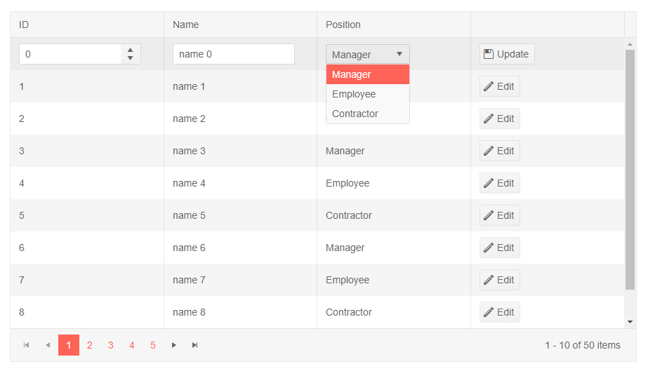
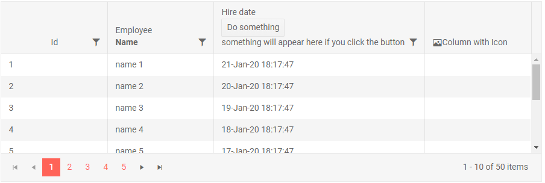
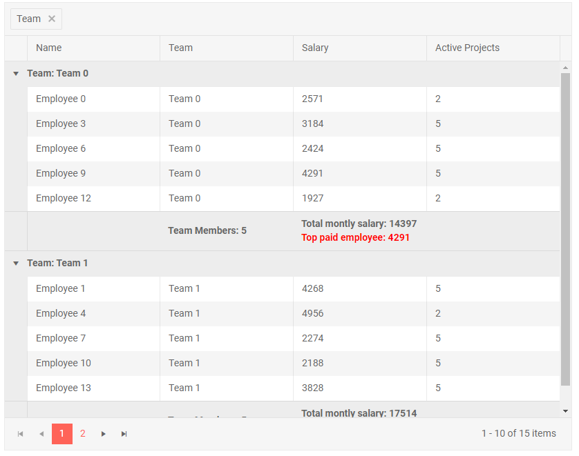
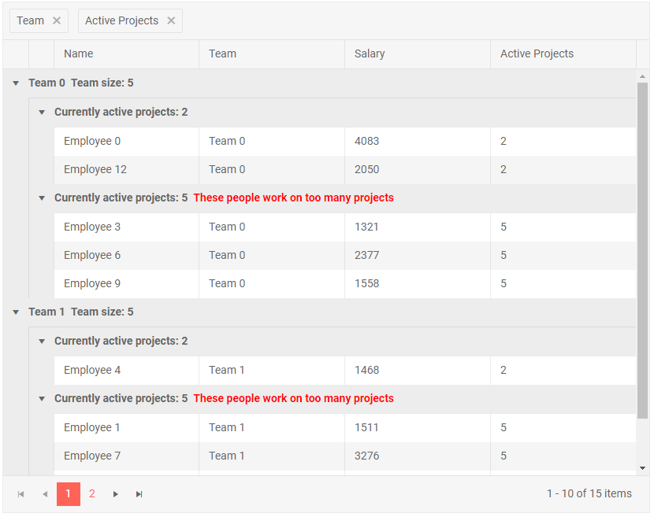

# Grid Templates

The Grid component can use templates for: 
* [columns (cells)](#column-template)
* [rows](#row-template)
* [editing of a field](#edit-template)
* [column header](#header-template)
* [column group footer](#column-group-footer)
* [group header](#group-header)


Like other Blazor content, they can receive a `context` argument that is the type of the model. To use templates, you must bind the grid to a named model.

You must make sure to provide valid HTML in the templates.

## Column Template

By default, the grid renders the value of the field in the column, as it is provided from the data source. You can change this behavior by using the `Template` of the column and add your own content and/or logic to make a string out of the object.

The example below shows how to:

* set the `Template` (make sure to use the capital `T`, at the time of writing the Visual Studio autocomplete tends to use the lowercase `t` which breaks the template logic and does not allow you to access the context)
* access the `context` of the model item so you can employ your own logic
* set HTML in the column
* use inline or multi-line template
* take the field name from the model

>caption Using cell (column) template

````CSHTML
Cell template that renders an image based on model data

<TelerikGrid Data="@MyData" Height="500px">
	<GridColumns>
		<GridColumn Field="@(nameof(SampleData.ID))" Title="Photo">
			<Template>
				@{
					var employee = context as SampleData;
					
				}
			</Template>
		</GridColumn>
		<GridColumn Field="@(nameof(SampleData.Name))" Title="Employee Name">
			<Template>
				Employee name is:
				<br />
				@((context as SampleData).Name)
			</Template>
		</GridColumn>
		<GridColumn Field="HireDate" Title="Hire Date - Default string">
		</GridColumn>
		<GridColumn Field="HireDate" Title="Hire Date - Custom string">
			<Template>
				@((context as SampleData).HireDate.ToString("dd MMM yyyy"))
			</Template>
		</GridColumn>
	</GridColumns>
</TelerikGrid>

@code {
	public class SampleData
	{
		public int ID { get; set; }
		public string Name { get; set; }
		public DateTime HireDate { get; set; }
	}

	public IEnumerable<SampleData> MyData = Enumerable.Range(1, 50).Select(x => new SampleData
	{
		ID = x,
		Name = "name " + x,
		HireDate = DateTime.Now.AddDays(-x)
	});
}
````

>caption The result from the code snippet above


## Row Template

The row template allows you to define in your own code the entire contents of the `<tr>` element the grid will render for each record. To set it, provide contents to the `<RowTemplate>` inner tag of the grid.

It can be convenient if you want to use templates for most or all of the columns, as it requires less markup than setting individual templates for many columns.

The contents of the row template must be `<td>` elements and their number (or total `colspan`) must match the number of columns defined in the grid.

You can use the `Context` attribute of the `<RowTemplate>` tag of the grid to set the name of the context variable. Its type is the model type to which the grid is bound.

>important Using the row template takes functionality away from the grid because it no longer controls its own rendering. For example, InCell and Inline editing could not render editors, detail templates will not be available, column resizing and reordering cannot change the data cells anymore, only the headers, and row selection must be implemented by the app ([example](https://feedback.telerik.com/blazor/1463819)).

>caption Using a row template

````CSHTML
Render the entire row with your own code and logic

<TelerikGrid Data=@MyData Height="500px">
	<RowTemplate Context="employee">
		<td>
			
			<strong>@employee.Name</strong>
		</td>
		<td>
			Hired on: @(String.Format("{0:dd MMM yyyy}", employee.HireDate))
		</td>
	</RowTemplate>
	<GridColumns>
		<GridColumn Field=@nameof(SampleData.Name) Title="Employee Name" />
		<GridColumn Field=@nameof(SampleData.HireDate) Title="Hire Date" />
	</GridColumns>
</TelerikGrid>

@code {
	public class SampleData
	{
		public int ID { get; set; }
		public string Name { get; set; }
		public DateTime HireDate { get; set; }
	}

	public IEnumerable<SampleData> MyData = Enumerable.Range(1, 50).Select(x => new SampleData
	{
		ID = x,
		Name = "name " + x,
		HireDate = DateTime.Now.AddDays(-x)
	});
}
````

>caption The result from the code snippet above


## Edit Template

The column's `EditTemplate` defines the inline template or component that will be rendered when the user is [editing](#editing) the field.

You can data bind components in it to the current context, which is an instance of the model the grid is bound to. You will need a global variable that is also an instance of the model to store those changes. The model the template receives is a copy of the original model, so that changes can be cancelled (the `Cancel` command).

If you need to perform logic more complex than simple data binding, use the change event of the custom editor component to perform it. You can also consider using a [custom edit form](https://demos.telerik.com/blazor-ui/grid/editing-custom-form).

>caption Sample edit template

````CSHTML
@* This example shows how to use a dropdownlist to edit strings. You can implement any desired logic instead.
If you have an enum, the grid can edit and filter it out-of-the-box without the need for an edit template *@

<TelerikGrid Data=@MyData EditMode="@GridEditMode.Inline" Pageable="true" Height="500px" OnUpdate="@UpdateHandler">
    <GridColumns>
        <GridColumn Field=@nameof(SampleData.ID) Editable="false" Title="ID" />
        <GridColumn Field=@nameof(SampleData.Name) Title="Name" />
        <GridColumn Field=@nameof(SampleData.Role) Title="Position">
            <EditorTemplate>
                @{
                    CurrentlyEditedEmployee = context as SampleData;
                    <TelerikDropDownList Data="@Roles" @bind-Value="CurrentlyEditedEmployee.Role" Width="120px" PopupHeight="auto"></TelerikDropDownList>
                }
            </EditorTemplate>
        </GridColumn>
        <GridCommandColumn>
            <GridCommandButton Command="Save" Icon="save" ShowInEdit="true">Update</GridCommandButton>
            <GridCommandButton Command="Edit" Icon="edit">Edit</GridCommandButton>
        </GridCommandColumn>
    </GridColumns>
</TelerikGrid>

@code {
    public SampleData CurrentlyEditedEmployee { get; set; }

    public void UpdateHandler(GridCommandEventArgs args)
    {
        SampleData item = (SampleData)args.Item;

        //perform actual data source operations here
        //if you have a context added through an @inject statement, you could call its SaveChanges() method
        //myContext.SaveChanges();

        var index = MyData.FindIndex(i => i.ID == item.ID);
        if (index != -1)
        {
            MyData[index] = item;
        }
    }

    protected override void OnInitialized()
    {
        MyData = new List<SampleData>();

        for (int i = 0; i < 50; i++)
        {
            MyData.Add(new SampleData()
            {
                ID = i,
                Name = "name " + i,
                Role = Roles[i % Roles.Count]
            });
        }
    }

    //in a real case, keep the models in dedicated locations, this is just an easy to copy and see example
    public class SampleData
    {
        public int ID { get; set; }
        public string Name { get; set; }
        public string Role { get; set; }
    }

    public List<SampleData> MyData { get; set; }

    public static List<string> Roles = new List<string> { "Manager", "Employee", "Contractor" };
}
````

>caption The result from the code snippet above, after Edit was clicked on the first row and the user expanded the dropdown from the template




## Header Template

Bound columns render the name of the field or their `Title` in their header. Through the `HeaderTemplate`, you can define custom content there instead of the title text.

>caption Sample Header Template

````CSHTML
@* Header templates override the built-in title but leave sorting indicators and filter menu icons *@

<TelerikGrid Data="@MyData" Height="300px" Pageable="true" Sortable="true" FilterMode="@GridFilterMode.FilterMenu">
    <GridColumns>
        <GridColumn Field="@(nameof(SampleData.ID))" Title="This title will not be rendered">
            <HeaderTemplate>
                <div style="text-align:center">Id</div>
                @* this is a block element and it will push the sorting indicator, see the notes below *@
            </HeaderTemplate>
        </GridColumn>
        <GridColumn Field="@(nameof(SampleData.Name))">
            <HeaderTemplate>
                Employee<br /><strong>Name</strong>
            </HeaderTemplate>
        </GridColumn>
        <GridColumn Field="HireDate" Width="350px">
            <HeaderTemplate>
                Hire date<br />
                <TelerikButton OnClick="@DoSomething">Do something</TelerikButton>
                <br />
                @{
                    if (!string.IsNullOrEmpty(result))
                    {
                        <span style="color:red;">@result</span>
                    }
                    else
                    {
                        <div>something will appear here if you click the button</div>
                    }
                }
            </HeaderTemplate>
        </GridColumn>
        <GridColumn>
            <HeaderTemplate>
                <span class="k-display-flex k-align-items-center">
                    <TelerikIcon Icon="@IconName.Image" />
                    Column with Icon
                </span>
            </HeaderTemplate>
        </GridColumn>
    </GridColumns>
</TelerikGrid>

@code {
    string result { get; set; }
    void DoSomething()
    {
        result = $"button in header template clicked on {DateTime.Now}, something happened";
    }

    public class SampleData
    {
        public int ID { get; set; }
        public string Name { get; set; }
        public DateTime HireDate { get; set; }
    }

    public IEnumerable<SampleData> MyData = Enumerable.Range(1, 50).Select(x => new SampleData
    {
        ID = x,
        Name = "name " + x,
        HireDate = DateTime.Now.AddDays(-x)
    });
}
````

>caption The result from the code snippet above



>note Header Templates are not available for the `GridCheckboxColumn` and the `GridCommandColumn`.

>note If you need to use block elements in the header templates, keep in mind that they will push the sort indicator out of its expected position. If you cannot avoid block elements (such as in the `ID` column in the example above), add a CSS rule like the ones below to adjust the sort indicator.

>caption Sort indicator adjustments when block elements are in the header template

````CSS
.k-grid th.k-header .k-icon.k-i-sort-asc-sm,
.k-grid th.k-header .k-icon.k-i-sort-desc-sm {
    position: absolute;
    right: 0;
    top: 8px;
}

/* OR */

.k-grid-header .k-header > .k-link {
    padding-right: 1.5em;
}

    .k-grid-header .k-header > .k-link > .k-icon {
        position: absolute;
        top: 50%;
        right: 0.5em;
        transform: translateY(-50%);
        margin-left: 0;
    }

.k-grid-header .k-sort-order {
    position: absolute;
    right: 0.25em;
}
````

## Column Group Footer

When the grid is grouped, the columns can display a footer with information about the column data [aggregates]() and some custom text/logic. The template is strongly typed and exposes the available aggregates values.

>caption Sample Column Group Footer Template

````CSHTML
@* Group by the Team column to see the results and aggregate data in the footer *@

<TelerikGrid Data=@GridData Groupable="true" Pageable="true" Height="650px">
    <GridAggregates>
        <GridAggregate Field=@nameof(Employee.Team) Aggregate="@GridAggregateType.Count" />
        <GridAggregate Field=@nameof(Employee.Salary) Aggregate="@GridAggregateType.Max" />
        <GridAggregate Field=@nameof(Employee.Salary) Aggregate="@GridAggregateType.Sum" />
    </GridAggregates>
    <GridColumns>
        <GridColumn Field=@nameof(Employee.Name) Groupable="false" />
        <GridColumn Field=@nameof(Employee.Team) Title="Team">
            <GroupFooterTemplate>
                Team Members: <strong>@context.Count</strong>
            </GroupFooterTemplate>
        </GridColumn>
        <GridColumn Field=@nameof(Employee.Salary) Title="Salary" Groupable="false">
            <GroupFooterTemplate>
                @* you can use a group footer for non-groupable columns as well *@
                Total montly salary: @context.Sum
                <br />
                <span style="color: red;">Top paid employee: @context.Max</span>
            </GroupFooterTemplate>
        </GridColumn>
        <GridColumn Field=@nameof(Employee.ActiveProjects) Title="Active Projects">
        </GridColumn>
    </GridColumns>
</TelerikGrid>

@code {
    public List<Employee> GridData { get; set; }

    protected override void OnInitialized()
    {
        GridData = new List<Employee>();
        var rand = new Random();
        for (int i = 0; i < 15; i++)
        {
            Random rnd = new Random();
            GridData.Add(new Employee()
            {
                EmployeeId = i,
                Name = "Employee " + i.ToString(),
                Team = "Team " + i % 3,
                Salary = rnd.Next(1000, 5000),
                ActiveProjects = i % 4 == 0 ? 2 : 5
            });
        }
    }

    public class Employee
    {
        public int EmployeeId { get; set; }
        public string Name { get; set; }
        public string Team { get; set; }
        public decimal Salary { get; set; }
        public int ActiveProjects { get; set; }
    }
}
````

>caption The result from the code snippet above after grouping by the `Team` column



## Group Header

When the grid is grouped, the top row above the group provides information about the current group value by default. You can use this template to add custom content there in addition to the current value. For more information and examples, see the [Aggregates]() article.

>caption Sample Group Header Template

````CSHTML
@* Group by the Team and Active Projects fields to see the results *@

<TelerikGrid Data=@GridData Groupable="true" Pageable="true" Height="650px">
    <GridAggregates>
        <GridAggregate Field=@nameof(Employee.Team) Aggregate="@GridAggregateType.Count" />
    </GridAggregates>
    <GridColumns>
        <GridColumn Field=@nameof(Employee.Name) Groupable="false" />
        <GridColumn Field=@nameof(Employee.Team) Title="Team">
            <GroupHeaderTemplate>
                @context.Value @* the default text you would get without the template *@
                &nbsp;<span>Team size: @context.Count</span>
            </GroupHeaderTemplate>
        </GridColumn>
        <GridColumn Field=@nameof(Employee.Salary) Title="Salary" Groupable="false" />
        <GridColumn Field=@nameof(Employee.ActiveProjects) Title="Active Projects">
            <GroupHeaderTemplate>
                @{
                    <span>Currently active projects: @context.Value &nbsp;</span>

                    //sample of conditional logic in the group header
                    if ( (int)context.Value > 3) // in a real case, ensure type safety and add defensive checks
                    {
                        <strong style="color: red;">These people work on too many projects</strong>
                    }
                }
            </GroupHeaderTemplate>
        </GridColumn>
    </GridColumns>
</TelerikGrid>

@code {
    public List<Employee> GridData { get; set; }

    protected override void OnInitialized()
    {
        GridData = new List<Employee>();
        var rand = new Random();
        for (int i = 0; i < 15; i++)
        {
            Random rnd = new Random();
            GridData.Add(new Employee()
            {
                EmployeeId = i,
                Name = "Employee " + i.ToString(),
                Team = "Team " + i % 3,
                Salary = rnd.Next(1000, 5000),
                ActiveProjects = i % 4 == 0 ? 2 : 5
            });
        }
    }

    public class Employee
    {
        public int EmployeeId { get; set; }
        public string Name { get; set; }
        public string Team { get; set; }
        public decimal Salary { get; set; }
        public int ActiveProjects { get; set; }
    }
}
````

>caption The result from the code snippet above after grouping by the `Team` and `Active Projects` columns



## See Also

 * [Live Demo: Grid Templates](https://demos.telerik.com/blazor-ui/grid/templates)
 * [Live Demo: Grid Custom Editor Template](https://demos.telerik.com/blazor-ui/grid/customeditor)

