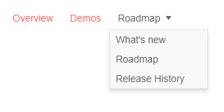

# Menu Data Binding to Flat Data

This article explains how to bind the Menu for Blazor to flat data. 
@[template](/_contentTemplates/menu/basic-example.md#data-binding-basics-link)


Flat data means that the entire collection of menu items is available at one level, for example `List<MyMenuModel>`.

The parent-child relationships are created through internal data in the model - the `ParentId` field which points to the `Id` of the item that will contain the current item. The root level has `null` for `ParentId`.

You are *not* required to provide a value for the `HasChildren` field. @[template](/_contentTemplates/menu/basic-example.md#has-children-behavior)

>caption Example of flat data in a menu (for brevity, URLs are omitted)

````CSHTML
Using a self-referencing flat data source for the menu

<TelerikMenu Data="@MenuItems"
             ParentIdField="@nameof(MenuItem.SectionId)"
             IdField="@nameof(MenuItem.Id)"
             TextField="@nameof(MenuItem.Section)">
</TelerikMenu>

@code {
    public List<MenuItem> MenuItems { get; set; }
    
    public class MenuItem
    {
        public int Id { get; set; }
        public int? SectionId { get; set; }
        public string Section { get; set; }
    }
    
    protected override void OnInitialized()
    {
        MenuItems = new List<MenuItem>()
        {
            new MenuItem()
            {
                Id = 1,
                Section = "Overview"
            },
            new MenuItem()
            {
                Id = 2,
                Section = "Demos"
            },
            new MenuItem()
            {
                Id = 3,
                Section = "Roadmap"
            },
            new MenuItem()
            {
                Id = 4,
                SectionId = 3,
                Section = "What's new"
            },
            new MenuItem()
            {
                Id = 5,
                SectionId = 3,
                Section = "Roadmap"
            },
            new MenuItem()
            {
                Id = 6,
                SectionId = 3,
                Section = "Release History"
            }
        };

        base.OnInitialized();
    }
}
````

>caption The result from the code snippet above, after hovering the "Roadmap" item




## See Also

  * [Menu Data Binding Basics]()
  * [Live Demo: Menu Flat Data](https://demos.telerik.com/blazor-ui/menu/flat-data)
  * [Binding to Hierarchical Data]()

