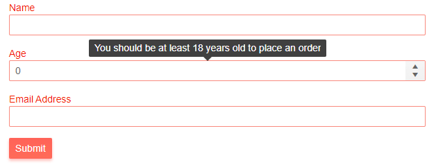
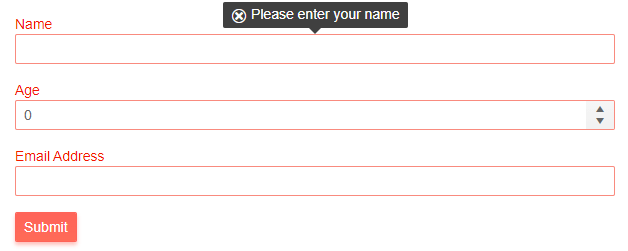
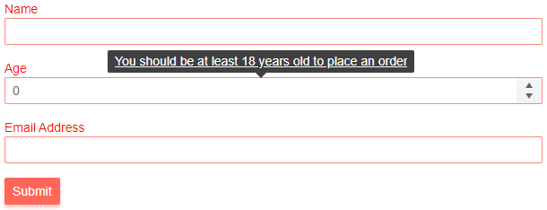

# Telerik Validation Tooltip for Blazor

The Telerik Validation Tooltip for Blazor can render the validation errors as tooltips pointing to the problematic input when you hover it. It acts like the ValidationMessage, but is a popup and not an inline element, so it takes up less space.

This article is separated in the following sections:

* [Basics](#basics)
* [Position](#position)
* [Template](#template)
* [Class](#class)

## Basics

To enable Telerik Validation Tooltip for a field in the form you should:

1. Provide a lambda expression in the `For` parameter that notifies the component for which property of the model the validation messages should render, just like the standard `ValidationMessage`.
1. Populate the `TargetSelector` with a CSS selector that controls which element(s) the Tooltip will associate itself with.

>caption Enable Telerik Validation Tooltip in a Telerik Form

>tip The Telerik Form can provide tooltips out-of-the-box with a single setting - see the [Form Validation - Validation Message Type](#validation-message-type) section. The example below shows more advanced customizations.

````CSHTML
@* Use the TelerikValidationTooltip component to render validation messages and disable the built-in validation messages from the Telerik Form*@

@using System.ComponentModel.DataAnnotations

<TelerikForm Model="@customer" Width="600px" ValidationMessageType="@FormValidationMessageType.None">
    <FormValidation>
        <DataAnnotationsValidator />
    </FormValidation>

    <FormItems>
        <FormItem Field="@nameof(Customer.CustomerName)" Id="customer-name-field" LabelText="Name" />
        <TelerikValidationTooltip For="@(() => customer.CustomerName)" TargetSelector="#customer-name-field" />

        <FormItem Field="@nameof(Customer.CustomerAge)" Id="customer-age-field" LabelText="Age" />
        <TelerikValidationTooltip For="@(() => customer.CustomerAge)" TargetSelector="#customer-age-field" />

        <FormItem Field="@nameof(Customer.EmailAddress)" Id="customer-email-field" LabelText="Email Address" />
        <TelerikValidationTooltip For="@(() => customer.EmailAddress)" TargetSelector="#customer-email-field" />
    </FormItems>
</TelerikForm>

@code {
    private Customer customer = new Customer();

    public class Customer
    {
        [Required(ErrorMessage = "Please enter your name")]
        [MaxLength(40, ErrorMessage = "The name must be up to 40 characters long")]
        public string CustomerName { get; set; }

        [Required(ErrorMessage = "Please enter your age")]
        [Range(18, 120, ErrorMessage = "You should be at least 18 years old to place an order")]
        public int CustomerAge { get; set; }

        [Required(ErrorMessage = "Please enter your email")]
        [EmailAddress(ErrorMessage = "Enter a valid email address")]
        public string EmailAddress { get; set; }
    }
}
````

>caption The result from the code snippet above




>caption Enable Telerik Validation Tooltip in an EditForm

````CSHTML
@using System.ComponentModel.DataAnnotations

<EditForm Model="@customer" width="600px">
    <DataAnnotationsValidator />

    <InputText @bind-Value="@customer.CustomerName" id="name"></InputText>
    <TelerikValidationTooltip For="@(() => customer.CustomerName)" TargetSelector="#name" />
    <br />
    <InputNumber @bind-Value="@customer.CustomerAge" id="age"></InputNumber>
    <TelerikValidationTooltip For="@(() => customer.CustomerAge)" TargetSelector="#age" />
    <br />
    <InputText @bind-Value="@customer.EmailAddress" id="email"></InputText>
    <TelerikValidationTooltip For="@(() => customer.EmailAddress)" TargetSelector="#email" />
    <br />
    <input type="submit" value="Submit" />
</EditForm>

@code {
    private Customer customer = new Customer();

    public class Customer
    {
        [Required(ErrorMessage = "Please enter your name")]
        [MaxLength(40, ErrorMessage = "The name must be up to 40 characters long")]
        public string CustomerName { get; set; }

        [Required(ErrorMessage = "Please enter your age")]
        [Range(18, 120, ErrorMessage = "You should be at least 18 years old to place an order")]
        public int CustomerAge { get; set; }

        [Required(ErrorMessage = "Please enter your email")]
        [EmailAddress(ErrorMessage = "Enter a valid email address")]
        public string EmailAddress { get; set; }
    }
}
````

>caption The result from the code snippet above


## Position

You can control the position of the validation tooltip through the `Position` parameter. It takes a member of the `TooltipPosition` enum:

* `Top` - by default the validation tooltip will render on top of the editor
* `Bottom`
* `Right`
* `Left`

````CSHTML
@* Change the rendering position of the validation tooltip *@ 

@using System.ComponentModel.DataAnnotations

<TelerikForm Model="@customer" Width="600px" ValidationMessageType="@FormValidationMessageType.None">
    <FormValidation>
        <DataAnnotationsValidator />
    </FormValidation>

    <FormItems>
        <FormItem Field="@nameof(Customer.CustomerName)" Id="customer-name-field" LabelText="Name" />
        <TelerikValidationTooltip For="@(() => customer.CustomerName)" TargetSelector="#customer-name-field" Position="@TooltipPosition.Left" />

        <FormItem Field="@nameof(Customer.CustomerAge)" Id="customer-age-field" LabelText="Age"  />
        <TelerikValidationTooltip For="@(() => customer.CustomerAge)" TargetSelector="#customer-age-field" Position="@TooltipPosition.Bottom" />

        <FormItem Field="@nameof(Customer.EmailAddress)" Id="customer-email-field" LabelText="Email Address" />
        <TelerikValidationTooltip For="@(() => customer.EmailAddress)" TargetSelector="#customer-email-field" Position="@TooltipPosition.Right" />
    </FormItems>
</TelerikForm>

@code {
    private Customer customer = new Customer();

    public class Customer
    {
        [Required(ErrorMessage = "Please enter your name")]
        [MaxLength(40, ErrorMessage = "The name must be up to 40 characters long")]
        public string CustomerName { get; set; }

        [Required(ErrorMessage = "Please enter your age")]
        [Range(18, 120, ErrorMessage = "You should be at least 18 years old to place an order")]
        public int CustomerAge { get; set; }

        [Required(ErrorMessage = "Please enter your email")]
        [EmailAddress(ErrorMessage = "Enter a valid email address")]
        public string EmailAddress { get; set; }
    }
}
````

>caption The result from the code snippet above


## Template

Allows you to control the rendering of the validation tooltip. The `context` represents an `IEnumerable<string>` collection of all messages for the property.

````CSHTML
@* Use the Template to customize the rendering of the validation tooltip *@

<TelerikForm Model="@customer" Width="600px" ValidationMessageType="@FormValidationMessageType.None">
    <FormValidation>
        <DataAnnotationsValidator />
    </FormValidation>

    <FormItems>
        <FormItem Field="@nameof(Customer.CustomerName)" Id="customer-name-field" LabelText="Name" />
        <TelerikValidationTooltip For="@(() => customer.CustomerName)" TargetSelector="#customer-name-field">
            <Template>
                @{ 
                    IEnumerable<string> validationContext = context;

                    @foreach (var message in validationContext)
                    {
                        <div>
                            <TelerikIcon Icon="x-outline"></TelerikIcon>
                            <span>@message</span>
                        </div>
                    }
                }
            </Template>
        </TelerikValidationTooltip>

        <FormItem Field="@nameof(Customer.CustomerAge)" Id="customer-age-field" LabelText="Age" />
        <TelerikValidationTooltip For="@(() => customer.CustomerAge)" TargetSelector="#customer-age-field" />

        <FormItem Field="@nameof(Customer.EmailAddress)" Id="customer-email-field" LabelText="Email Address" />
        <TelerikValidationTooltip For="@(() => customer.EmailAddress)" TargetSelector="#customer-email-field" />
    </FormItems>
</TelerikForm>

@code {
    private Customer customer = new Customer();

    public class Customer
    {
        [Required(ErrorMessage = "Please enter your name")]
        [MaxLength(40, ErrorMessage = "The name must be up to 40 characters long")]
        public string CustomerName { get; set; }

        [Required(ErrorMessage = "Please enter your age")]
        [Range(18, 120, ErrorMessage = "You should be at least 18 years old to place an order")]
        public int CustomerAge { get; set; }

        [Required(ErrorMessage = "Please enter your email")]
        [EmailAddress(ErrorMessage = "Enter a valid email address")]
        public string EmailAddress { get; set; }
    }
}
````

>caption The result from the code snippet above



## Class

You can use the `Class` parameter to add a custom CSS class to the validation tooltip.

````CSHTML
@* Use the Class parameter to underline the font of the validation message *@

<style>
    .my-custom-tooltip-class {
        text-decoration: underline;
    }
</style>

@using System.ComponentModel.DataAnnotations

<TelerikForm Model="@customer" Width="600px" ValidationMessageType="@FormValidationMessageType.None">
    <FormValidation>
        <DataAnnotationsValidator />
    </FormValidation>

    <FormItems>
        <FormItem Field="@nameof(Customer.CustomerName)" Id="customer-name-field" LabelText="Name" />
        <TelerikValidationTooltip For="@(() => customer.CustomerName)" TargetSelector="#customer-name-field" />

        <FormItem Field="@nameof(Customer.CustomerAge)" Id="customer-age-field" LabelText="Age"  />
        <TelerikValidationTooltip For="@(() => customer.CustomerAge)" TargetSelector="#customer-age-field" Class="my-custom-tooltip-class" />

        <FormItem Field="@nameof(Customer.EmailAddress)" Id="customer-email-field" LabelText="Email Address" />
        <TelerikValidationTooltip For="@(() => customer.EmailAddress)" TargetSelector="#customer-email-field" />
    </FormItems>
</TelerikForm>

@code {
    private Customer customer = new Customer();

    public class Customer
    {
        [Required(ErrorMessage = "Please enter your name")]
        [MaxLength(40, ErrorMessage = "The name must be up to 40 characters long")]
        public string CustomerName { get; set; }

        [Required(ErrorMessage = "Please enter your age")]
        [Range(18, 120, ErrorMessage = "You should be at least 18 years old to place an order")]
        public int CustomerAge { get; set; }

        [Required(ErrorMessage = "Please enter your email")]
        [EmailAddress(ErrorMessage = "Enter a valid email address")]
        public string EmailAddress { get; set; }
    }
}
````

>caption The result from the code snippet above



## See Also

* [Live Demo: Validation](https://demos.telerik.com/blazor-ui/validation/overview)
* [TelerikValidationSummary]()
* [TelerikValidationTooltip]()
* [Form Component]()

