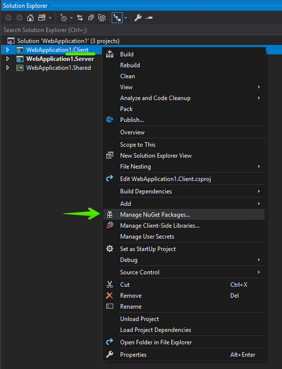

# First Steps with Client-side UI for Blazor

This article explains how to get the Telerik UI for Blazor components in your **Client-side** Blazor project and start using them quickly. The process consists of the following steps:

1. [Set Up a Blazor Project](#set-up-a-blazor-project)
1. [Add the Telerik NuGet Feed to Visual Studio](#add-the-telerik-nuget-feed-to-visual-studio)
1. [Add the Telerik Components to Your Project](#add-the-telerik-components-to-your-project)
    * [Add to an Existing Project](#add-to-existing-project)
1. [Add a Telerik Component to a View](#add-a-telerik-component-to-a-view)

@[template](/_contentTemplates/common/get-started.md#add-latest-ms-bits-client-side-link)

@[template](/_contentTemplates/common/get-started.md#add-nuget-feed)

## Add the Telerik Components to Your Project

For client-side `Blazor App`, we recommend the usage of `Blazor (ASP.NET Hosted)` project. 
@[template](/_contentTemplates/common/get-started.md#project-creation-part-1)

1. Choose the `Blazor WebAssembly App` project type, select the `ASP.NET Core hosted` checkbox, and click `Create`.

    

### Add to Existing Project

@[template](/_contentTemplates/common/get-started.md#get-access)

    1. Right-click on the `Client` project in the solution and select `Manage NuGet Packages`:
    
       
    
    1. Choose the `telerik.com` feed, find the **`Telerik.UI.for.Blazor`** package and click `Install` (make sure to use the latest version). If you don't have a commercial license, you will only see `Telerik.UI.for.Blazor.Trial`. Use that instead.
    
         

        
1. Open the `~/wwwroot/index.html` file in the client web application and register the [Theme stylesheet]():

    **HTML**
    
        <link rel="stylesheet" href="https://unpkg.com/@progress/kendo-theme-default@latest/dist/all.css" />
        

1. @[template](/_contentTemplates/common/js-interop-file.md#add-js-interop-file-to-getting-started-client)
        
1. Open the `~/Startup.cs` file in the client web application and register the Telerik Blazor service:

    **C#**
    
         namespace MyBlazorAppName.Client
         {
             public class Startup
             {
                 public void ConfigureServices(IServiceCollection services)
                 {
                     //more code may be present here
                     services.AddTelerikBlazor();
                 }
                 
                 //more code may be present here
             }
         }
         
1. @[template](/_contentTemplates/common/get-started.md#telerik-main-container-text)

    **MainLayout.razor**
    
        @[template](/_contentTemplates/common/get-started.md#telerik-main-container-snippet)

1. @[template](/_contentTemplates/common/issues-and-warnings.md#mono-linker-issue)

    
Now your project can use the Telerik UI for Blazor components.

## Add a Telerik Component to a View

The final step is to actually use a component on a view and run it in the browser. For example:

1. **Add** a **Button** component to the `~/Pages/Index.cshtml` view:
@[template](/_contentTemplates/common/get-started.md#add-component-sample)

## See Also

* [Get Started with Server-side Blazor]()
* [Telerik Private NuGet Feed]()
* [Getting Started Videos for Blazor](https://www.youtube.com/watch?v=aaRAZYaJ4xc&list=PLvmaC-XMqeBYPTwcm478vs8Rujq2tiVJo)

