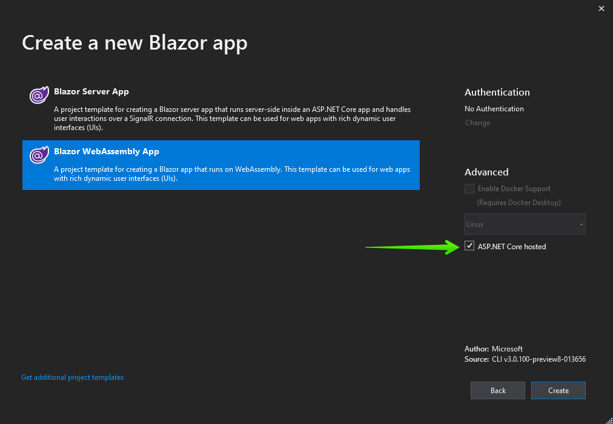
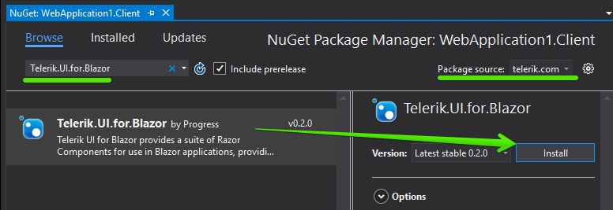

# First Steps with UI for Blazor

This article explains how to get the Telerik UI for Blazor components in your project and start using them quickly. The process consists of the following steps:

1. [Set Up a Blazor Project](#set-up-a-blazor-project)
1. [Add the Telerik NuGet Feed to Visual Studio](#add-the-telerik-nuget-feed-to-visual-studio)
1. [Add the Telerik Components to Your Project](#add-the-telerik-components-to-your-project)
1. [Add a Telerik Component to a View](#add-a-telerik-component-to-a-view)

<!-- Once you have your first simple control up and running, take a look at the [next steps](#next-steps) section to start exploring the control functionality in more detail.-->

## Set Up a Blazor Project

[Blazor](https://blazor.net/) is still an experimental technology, so you need to ensure you can run its vanilla version first. To do that, follow the MSDN tutorial and make sure that you can run the basic sample Blazor application: [https://docs.microsoft.com/en-us/aspnet/core/client-side/spa/blazor/get-started](https://docs.microsoft.com/en-us/aspnet/core/client-side/spa/blazor/get-started).

>tip Make sure that you have the latest bits installed (ASP.NET Core 3.0 and Visual Studo 2019 Preview channel are required). You can also use the official VS 2019 installation and enable the .NET Core 3.0 Preview in Tools > Options > Projects and Solutions > .NET Core -> select "Use previews of the .NET Core SDK".

Once you have a Blazor application running, continue to the next steps.

## Add the Telerik NuGet Feed to Visual Studio

Telerik UI for Blazor is distributed through our private NuGet feed. If you already have that working (for exapmle, you have used other tools of ours through it), skip to the [Add the Telerik Components to Your Project](#add-the-telerik-components-to-your-project) section.

To add the Telerik private NuGet feed, follow the steps below:

1. Download the [latest NuGet executable](https://dist.nuget.org/win-x86-commandline/latest/nuget.exe).
1. Open a Command Prompt and change the path to where the `nuget.exe` is downloaded.
1. Execute the command from the example below.

### Store Encrypted Credentials

The command from the example below stores a token in the `%AppData%\NuGet\NuGet.config` file. Your original credentials cannot be obtained from this token.

>note If you are unable to connect to the feed by using encrypted credentials, try the alternative approach of storing credentials in clear text explained below. The ASP.NET Core tooling this steps on does not fully support encrypted credentials.

>caption Store Encrypted Credentials for the Telerik NuGet feed

```
NuGet Sources Add -Name "telerik.com" -Source "https://nuget.telerik.com/nuget" ^
      -UserName "your login email" -Password "your password"
```

### Store Credentials in Clear Text for the Telerik NuGet feed

The command from the example below stores the password in clear text in the `%AppData%\NuGet\NuGet.config` file. If you are unable to connect to the feed using encrypted credentials, use this alternative approach.

>caption Store Plain-text Credentials for the Telerik NuGet feed

```
NuGet Sources Add -Name "telerik.com" -Source "https://nuget.telerik.com/nuget" ^
      -UserName "your login email" -Password "your password" ^
      -StorePasswordInClearText
```

If you have already stored a token instead of storing the credentials as clear text, update the definition in the `%AppData%\NuGet\NuGet.config` file by using the following command.

>caption Update Plain-text Credentials for the Telerik NuGet feed

```
NuGet Sources Update -Name "telerik.com" -Source "https://nuget.telerik.com/nuget" ^
      -UserName "your login email" -Password "your password" ^
      -StorePasswordInClearText
```


## Add the Telerik Components to Your Project

We recommend the usage of `Blazor (ASP.NET Hosted)` project. If you have one, go to the [Add to Existing Project](#add-to-existing-project) section below.

If you don't have a Blazor project set up, first you need to create one:

1. Open Visual Studio 2019

1. Create a New Project

1. Choose `ASP.NET Core Web Application` and click `Next`. Then, choose a name and location for the project and click `Create`.

    

1. Choose the `Blazor (ASP.NET Hosted)` project type and click `Create`.

    


### Add to Existing Project

To get access to the UI for Blazor components, follow these steps:

1. Activate a trial by visiting the following link: [https://www.telerik.com/download-trial-file/v2-b/ui-for-blazor](https://www.telerik.com/download-trial-file/v2-b/ui-for-blazor)

1. Install the `Telerik.UI.for.Blazor` NuGet package to your Blazor project. If you do not see it in the `telerik.com` feed, wait for a about 20-30 minutes after activating the trial:

    1. Right-click on the `Client` project in the solution and select `Manage NuGet Packages`:
    
       
    
    1. Choose the `telerik.com` feed, find the `Telerik.UI.for.Blazor` package and click `Install`:
    
         

1. Open the `_ViewImports.cshtml` at the root of the client web application and add the following line to register the Telerik components for the entire project:

    **CSHTML**
    
        @addTagHelper *,Telerik.Blazor
        
1. Open the `~/wwwroot/index.html` file in the client web application and register the [Theme stylesheet]() (make sure to use the correct version that matches the official Kendo UI for jQuery release number):

    **HTML**
    
        <link id="kendoCss" rel="stylesheet" href="https://unpkg.com/@progress/kendo-theme-default@latest/dist/all.css" />

    
Now your project can use the Telerik UI for Blazor components in all its views.

## Add a Telerik Component to a View

The final step is to actually use a component on a view and run it in the browser. For example:

1. **Add** a **Button** component to the `~/Pages/Index.cshtml` view:

    **CSHTML**
    
        <TelerikButton>Say Hello</TelerikButton>
        
1. Optionally, hook up a click handler that will show a message. The resulting view should look like this:

    **CSHTML**
    
        @page "/"
        @using Microsoft.AspNetCore.Components
        
        <TelerikButton OnClick="@SayHelloHandler" Class="k-primary">Say Hello</TelerikButton>
        
        <br />
        
        @helloString
        
        @functions {
           MarkupString helloString;
        
           void SayHelloHandler()
           {
               string msg = string.Format("Hello from <strong>Telerik Blazor</strong> at {0}.<br /> Now you can use C# to write front-end!", DateTime.Now);
               helloString = new MarkupString(msg);
           }
        }

1. **Run the app** in the browser by pressing `F5`. You should see something like this:

    

Now you have the Telerik components running in your Blazor app.

Next, you can explore the [live demos](https://demos.telerik.com/blazor) and the [examples repo](https://github.com/telerik/ui-for-blazor-examples/) we have.
