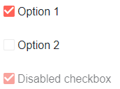
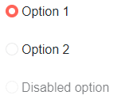
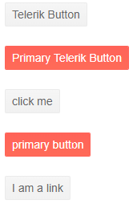

# Styles for Form Elements

The [UI for Blazor Themes]() provide classes that you can use to style elements on the page so they can match the used Telerik Theme.

The Themes are shared with the Kendo library and you can reuse any existing knowledge about the classes that are available. This article will provide several examples of how you can style generic elements through the Telerik Themes so they match the colors and styling of the Telerik components, and so they look the same across browsers.

* [Checkboxes](#checkboxes)
* [Radio Buttons](#radio-buttons)
* [Inputs](#inputs)
* [Buttons](#buttons)
* [Cards](#cards)

>note CSS rules from the project may interfere. A common reason is styling from libraries like Bootstrap or rules with low specificity in the site stylesheet. [This blog post](https://www.telerik.com/blogs/improve-your-debugging-skills-with-chrome-devtools) can help you examine the rendering and applied styles so you can troubleshoot any issues.

## Checkboxes

A specific class on a `label` element can give you a checkbox that looks the same in all browsers. You will still need the actual `input` element, but it will have another class that will hide it visually.

>tip You can use the [TelerikCheckBox]() component instead. It offers a few extra features and events.



>caption Checkboxes with Telerik Theme styling

````HTML
<input type="checkbox" id="cb1" class="k-checkbox" checked="checked">
<label class="k-checkbox-label" for="cb1">Option 1</label>
<br /><br />
<input type="checkbox" id="cb2" class="k-checkbox">
<label class="k-checkbox-label" for="cb2">Option 2</label>
<br /><br />
<input type="checkbox" id="cb3" class="k-checkbox" checked="checked" disabled="disabled">
<label class="k-checkbox-label" for="cb3">Disabled checkbox</label>
````

## Radio Buttons

A specific class on a `label` element can give you a radio buttons that looks the same in all browsers. You will still need the actual `input` element, but it will have another class that will hide it visually.

>note Blazor cannot yet handle binding radio buttons. You can find more details in [this issue](https://github.com/aspnet/AspNetCore/issues/5579).



>caption Radio Buttons with Telerik Theme styling

````HTML
<input type="radio" name="radioButton" id="opt1" class="k-radio" checked="checked">
<label class="k-radio-label" for="opt1">Option 1</label>
<br /><br />
<input type="radio" name="radioButton" id="opt2" class="k-radio">
<label class="k-radio-label" for="opt2">Option 2</label>
<br /><br />
<input type="radio" name="radioButton" id="opt2" class="k-radio" disabled="disabled">
<label class="k-radio-label" for="opt1">Disabled option</label>
````

## Inputs

You can match standard `input` elements with the styling of a Telerik component like a numeric textbox.

>tip Telerik provides the majority of necessary inputs - [numeric](../components/numerictextbox/overview) textbox, [date](../components/datepicker/overview) and [time](../components/timepicker/overview) pickers, [password](../components/textbox/overview) input, various [dropdowns](../components/combobox/overview).


>caption Textbox with Telerik Theme styling

````CSHTML
<TelerikTextBox Label="Username:" />
<br /><br />
<input type="password" placeholder="Password:" class="k-textbox" />
````


## Buttons

You can match standard `button` and `a` elements with the styling of a Telerik Button. Note that other CSS rules from libraries like Bootstrap may interfere.



>caption Button with Telerik Theme styling

````HTML
<TelerikButton>Telerik Button</TelerikButton>
<br /><br />
<TelerikButton Primary="true">Primary Telerik Button</TelerikButton>
<br /><br />
<input type="button" value="click me" class="k-button" />
<br /><br />
<input type="button" value="primary button" class="k-button k-primary" />
<br /><br />
<a href="somePage" class="k-button">I am a link</a>
````

## Cards

The Telerik Themes carry styling for card elements. You can read more about them in the [Kendo UI Cards](https://docs.telerik.com/kendo-ui/styles-and-layout/cards) article.

>tip The Cards that Telerik provides styles and sample HTML for can be put into reusable Blazor components in your app where you can define titles and content templates and any other features if needed by your use case and expose them as parameters.

## See Also

  * [Font Icons]()
